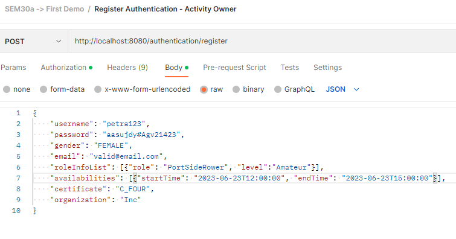
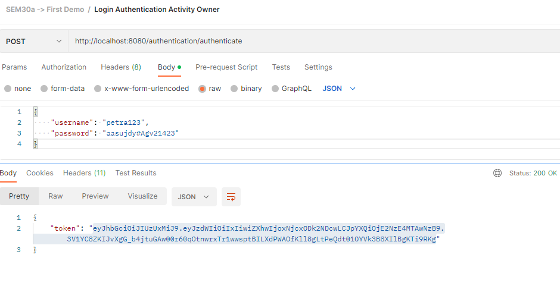
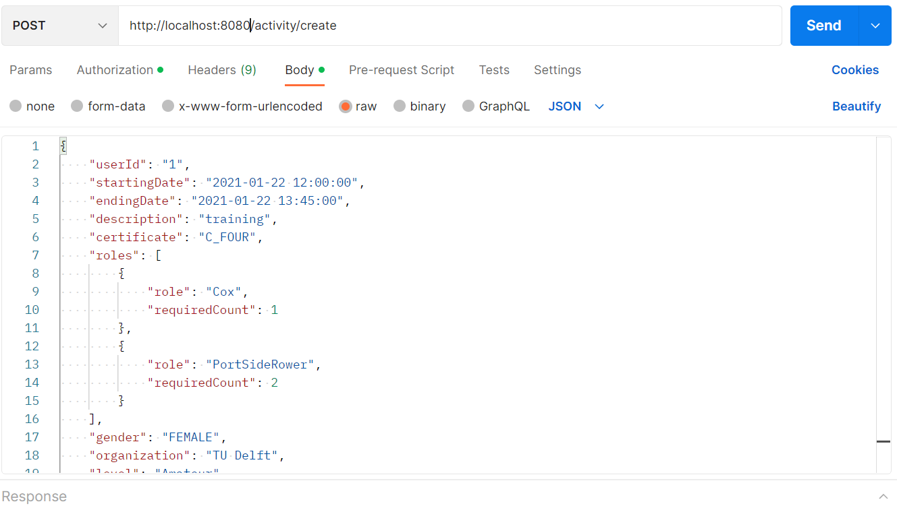

# SEM30a ROW Project

This template contains six microservices:
- authentication-microservice 
- activity-microservice (core)
- gateway-microservice
- messaging-microservice (core)
- planning-microservice (core)
- user-microservice (core)

The `authentication-microservice` is responsible for registering new users and authenticating current ones. After successful authentication, this microservice will provide a JWT token which can be used to bypass the all other core microservices. This token contains the username of the user that authenticated.

The `activity-microservice` saves the activities created by users and provides functionality to filter eligible activities to send to the planning microservice.

The `gateway-microservice` allows requests to be navigated through a single port. It redirects requests to the corresponding core microservices.

The `messaging-microservice` sends notifications to the users via their email.

The `planning-microservice` receives user information and provide eligible activities to the user. It also verifies if a user is eligible for the acitivity when he/she applies.

The `user-microservice` registers and saves user information.

Functional tests via Postman are provided in the `documents` folder.

## Running the microservices

You can run the all microservices individually by starting the Spring applications. 
For each request, all the associated microservices must be started.
Then, you can use *Postman* to perform the different requests:

1. When accessing endpoints in the core microservices, you must attain the bearer token through the authentication service. For this request, user application must be started as well because the endpoint in authentication communicates with the user microservice.

2. Authenticate by making request to the authentication microservice. 

3. If the authenticate request is valid, a token is returned as a response. In the authorization tab of Postman, select Bearer Token as the type and input the received token for any future requests made to other microservices.

For making requests through the gateway microservice, the gateway microservice should be started along with the associated microservices of the request.
Gateway is started on port 8080, and each microservice can be accessed through the following format: http://localhost:8080/<microservicePath>.

<microservicePath> should be replaced with the following:
- authentication: authentication
- messaging: messaging
- planning: planning
- user: user
- activity: activity

Then, the path is followed by the endpoint path particular to the method.
For all requests to core microservices via the gateway should also have the bearer token.

Example of request via the gateway to activity microservice createActivity method in ActivityController:

## EXAMPLE
A very thorough example of how the application runs, including explanations, edge cases and a nice story can be found in the documents folder in functional-testing: a .pdf named FullApplicationFlow.
It includes postman requests and detailed overview of what is supposed to happen.

